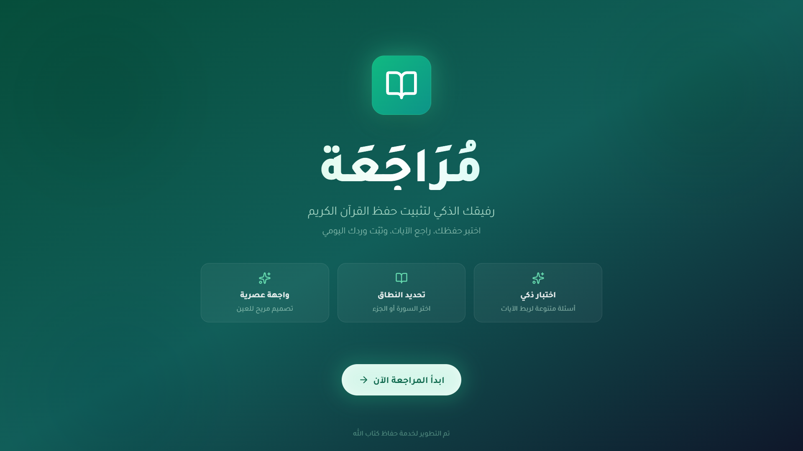

# مُرَاجَعَة (Murajaa)

مُرَاجَعَة هو تطبيق ويب حديث صُمم لمساعدة المسلمين على مراجعة وتثبيت حفظهم للقرآن الكريم. يوفر التطبيق واجهة اختبار تفاعلية لاختبار معرفتك بتسلسل الآيات.



## المميزات

- **اختيار مرن**: اختر المراجعة حسب **جزء** محدد أو **سورة**.
- **نطاقات مخصصة**: حدد نطاقًا معينًا من الآيات داخل السورة لتركيز المراجعة.
- **اختبار ذكي**:
  - **الآية التالية**: تُعطى آية، وعليك معرفة الآية التي تليها.
  - **الآية السابقة**: تُعطى آية، وعليك معرفة الآية التي تسبقها.
- **تقييم ذاتي**: التقييم يتم بواسطتك، وليس بواسطة الذكاء الاصطناعي. أنت تتحقق من إجابتك لضمان الدقة.
- **واجهة جميلة**: واجهة عربية نظيفة، عصرية، ومتجاوبة مصممة للتركيز.
- **تتبع التقدم**: تغذية راجعة فورية وملخص للنتيجة بعد كل جلسة.
- **سجل الاختبارات**: حفظ نتائج اختباراتك السابقة للرجوع إليها ومتابعة تقدمك.
- **الوضع الليلي**: دعم كامل للوضع الليلي لراحة العين.

## صور من التطبيق


## التقنيات المستخدمة

- **إطار العمل**: [React](https://react.dev/) مع [Vite](https://vitejs.dev/)
- **اللغة**: [TypeScript](https://www.typescriptlang.org/)
- **التنسيق**: [Tailwind CSS](https://tailwindcss.com/)
- **الأيقونات**: [Lucide React](https://lucide.dev/)

## البدء

### المتطلبات

- Node.js (الإصدار 18 أو أعلى موصى به)
- npm أو yarn

### التثبيت

1.  استنسخ المستودع:
    ```bash
    git clone <repository-url>
    cd murajaa
    ```

2.  ثبت الاعتماديات:
    ```bash
    npm install
    ```

3.  شغل خادم التطوير:
    ```bash
    npm run dev
    ```

4.  افتح متصفحك وانتقل إلى `http://localhost:5173` (أو المنفذ الظاهر في الطرفية).

## البناء للإنتاج

لإنشاء نسخة جاهزة للإنتاج:

```bash
npm run build
```

الملفات المبنية ستكون في مجلد `dist`.

## الترخيص

تم إنشاء هذا المشروع بواسطة زهير دله.
